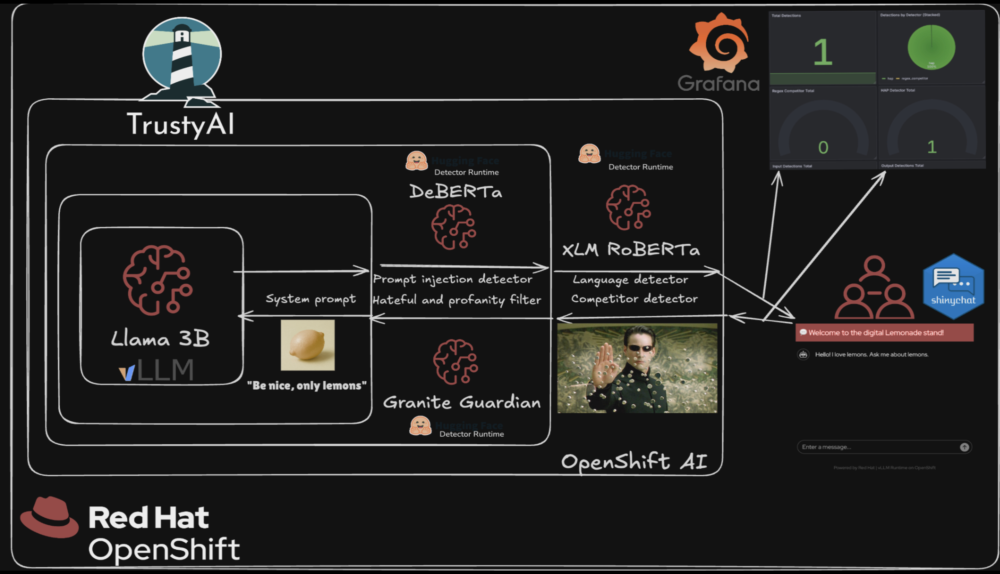
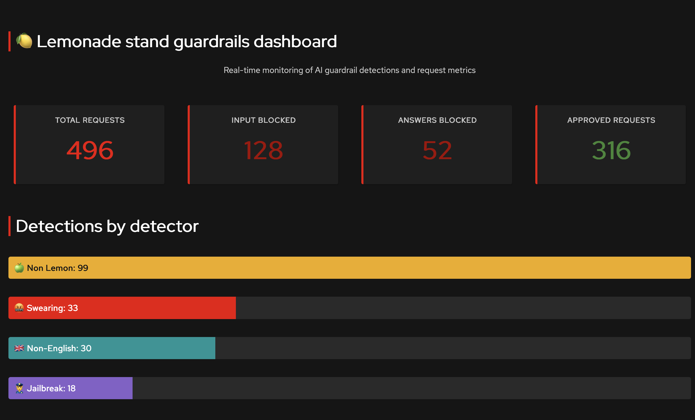

# Guardrail the Lemonade Stand Assistant

Deploy an AI-powered customer service assistant with built-in safety guardrails to ensure family-friendly, compliant interactions for your business. With a dashboard for metrics and a chat UI, abuse the system and see how it responds! 

Built by Anneli Sara Banderby and Cansu Kavili-Örnek. 

## Table of Contents

- [Detailed description](#detailed-description)
  - [Architecture diagrams](#architecture-diagrams)
  - [See it in action](#see-it-in-action)
  - [Monitoring dashboards](#monitoring-dashboards)
- [Requirements](#requirements)
  - [Minimum hardware requirements](#minimum-hardware-requirements)
  - [Minimum software requirements](#minimum-software-requirements)
- [Deploy](#deploy)
  - [Prerequisites](#prerequisites)
  - [Deployment](#deployment)
  - [Configuration options](#configuration-options)
  - [Validating the deployment](#validating-the-deployment)
  - [Delete](#delete)
- [Technical details](#technical-details)
  - [Architecture](#architecture)
  - [Models](#models)
  - [Deployment Configuration](#deployment-configuration)
- [Reference](#reference)
- [Tags](#tags)


## Detailed description

Imagine we run a successful lemonade stand and want to deploy a customer service agent so our customers can learn more about our products. We'll want to make sure all conversations with the agent are family friendly, and that it does not promote our rival fruit juice vendors.

This demo showcases how to deploy an AI-powered customer service assistant with multiple guardrails to ensure safe, compliant, and on-brand interactions. The solution uses [Llama 3.2](https://huggingface.co/RedHatAI/Llama-3.2-3B-Instruct-FP8-dynamic) as the default language model (or your own model endpoint), protected by three detector models that monitor for harmful content, prompt injection attacks, and language compliance.

**In this demo, we are following these principles:** 

1. The LLM is untrusted. All its output must be validated. 
2. The user is untrusted. All the input must be validated.
3. Triggering of specific detectors is monitored and visualized. (Alerts are out of scope but could be done)

The Lemonade Stand Assistant provides an interactive customer service experience for a fictional lemonade stand business. Customers can ask questions about products, ingredients, pricing, and more through a conversational interface.

https://github.com/user-attachments/assets/998dd37d-6130-4971-b8a2-d4ded8c40a27

To ensure safe and appropriate interactions, the system employs multiple AI guardrails:
- **[IBM HAP Detector (Granite Guardian)](https://huggingface.co/ibm-granite/granite-guardian-hap-125m)**: Monitors conversations for hate, abuse, and profanity
- **[Prompt Injection Detector (DeBERTa v3)](https://huggingface.co/protectai/deberta-v3-base-prompt-injection-v2)**: Identifies and blocks attempts to manipulate the AI assistant
- **[Lingua Language Detector](https://github.com/pemistahl/lingua)**: Ensures inputs and responses are in English only

Furthermore, there is a:
- **Regex Detector**: Blocks specific text without the use of models. In our case, it's other fruits we consider "competitors".

The guardrails orchestrator coordinates these detectors to evaluate inputs and outputs before presenting responses to users.

### Architecture Diagrams



### See it in action

**[▶️ View Interactive Demo](https://interact.redhat.com/share/ccMmWuFhRNPc9ppjTAz4)**


### Monitoring Dashboard

The solution includes an R Shiny monitoring dashboard for visualizing guardrail detections in real-time, including detections by detector type, total requests, input/output blocks, and approved requests.

**R Shiny Dashboard**



The Shiny dashboard is deployed automatically with the lemonade-stand-assistant by default.

The dashboard automatically fetches metrics from the lemonade-stand app every second and displays:
- Total requests counter
- Input blocked counter
- Output blocked counter  
- Approved requests counter
- Detection breakdown by guardrail type (with progress bars)

To access the dashboard after deployment:

```bash
# Get the dashboard URL
echo https://$(oc get route shiny-dashboard -n lemonade-stand-assistant --template='{{.spec.host}}')
```

## Requirements

### Minimum hardware requirements

**Llama 3.2 3B Instruct (Main LLM — only when deploying the default model):**
- CPU: 1 vCPU (request) / 4 vCPU (limit)
- Memory: 8 GiB (request) / 20 GiB (limit)
- GPU: 1 NVIDIA GPU (e.g., A10, A100, L40S, T4, or similar)

**IBM HAP Detector (Granite Guardian HAP 125M):**
- CPU: 1 vCPU (request) / 2 vCPU (limit)
- Memory: 4 GiB (request) / 8 GiB (limit)

**Prompt Injection Detector (DeBERTa v3 Base):**
- CPU: 4 vCPU (request) / 8 vCPU (limit)
- Memory: 16 GiB (request) / 24 GiB (limit)

**Lingua Language Detector:**
- CPU: 1 vCPU (request) / 2 vCPU (limit)
- Memory: 2 GiB (request) / 3 GiB (limit)

**Total Resource Requirements:**
- CPU: 7 vCPU (request) / 16 vCPU (limit)
- Memory: 30 GiB (request) / 51 GiB (limit)
- GPU: 1 NVIDIA GPU (only when deploying the default model)

> **Note**: If you bring your own model endpoint, the LLM resources and GPU are not required. The detector models are configured to run on CPU by default. If you have additional GPU resources available and want to improve detector performance, you can enable GPU acceleration for the detectors. See the [Configuration Options](#configuration-options) section for details on customizing GPU usage.

### Minimum software requirements

- Red Hat OpenShift Container Platform
- Red Hat OpenShift AI

## Deploy

### Prerequisites

Before deploying, ensure you have:
- Access to a Red Hat OpenShift cluster with OpenShift AI installed and TrustyAI enabled
- Cluster admin privileges to create the guardrails orchestrator resources
- `oc` CLI tool installed and configured
- `helm` CLI tool installed
- Sufficient resources available in your cluster

### Deployment

1. Clone the repository:
```bash
git clone https://github.com/rh-ai-quickstart/lemonade-stand-assistant.git
cd lemonade-stand-assistant
```

2. Create a new OpenShift project:
```bash
PROJECT="lemonade-stand-assistant"
oc new-project ${PROJECT}
```

3. Install using Helm:

**Option A: Use your own model (MaaS - Model as a Service)**

If you have an existing model endpoint, provide the model name, endpoint, port, and API key:
```bash
helm install lemonade-stand-assistant ./chart --namespace ${PROJECT} \
  --set model.name=YOUR_MODEL_NAME \
  --set model.endpoint=YOUR_ENDPOINT \
  --set model.port=443 \
  --set model.api_key=YOUR_API_KEY
```

> **Note**: The `model.endpoint` should be the hostname only, without `https://` prefix or trailing `/`.

**Option B: Deploy with the default model**

If you don't provide any model configuration, the chart will automatically deploy a Llama 3.2 3B Instruct model on your cluster:
```bash
helm install lemonade-stand-assistant ./chart --namespace ${PROJECT}
```

> **Note**: Option B requires a GPU available in your cluster for the LLM deployment. See [Minimum hardware requirements](#minimum-hardware-requirements) for details.

### Configuration Options

The deployment can be customized through the `values.yaml` file. Each detector can be configured to run on GPU or CPU depending on your available resources.

#### GPU Configuration

By default, only the LLM uses GPU acceleration. All detector models run on CPU.

Each detector supports the following configuration options:

- `useGpu`: Enable GPU acceleration for the detector (default: `false`)
- `resources`: CPU and memory resource requests and limits

**Example: Enable GPU for HAP detector (requires additional GPU)**
```bash
helm install lemonade-stand-assistant ./chart --namespace ${PROJECT} \
  --set detectors.hap.useGpu=true
```

**Example: Enable GPU for all configurable detectors (requires 3 total GPUs)**
```bash
helm install lemonade-stand-assistant ./chart --namespace ${PROJECT} \
  --set detectors.hap.useGpu=true \
  --set detectors.promptInjection.useGpu=true
```

**Example: Custom resource allocation for HAP detector**
```bash
helm install lemonade-stand-assistant ./chart --namespace ${PROJECT} \
  --set detectors.hap.resources.requests.memory=2Gi \
  --set detectors.hap.resources.limits.memory=4Gi
```

### Validating the deployment

Once deployed, access the Lemonade Stand Assistant UI. You can find the route with:

```bash
echo https://$(oc get route/lemonade-stand-assistant -n ${PROJECT} --template='{{.spec.host}}')
```

Open the URL in your browser and start asking questions about lemonade and other fruits!

### Delete

To remove the deployment:

```bash
helm uninstall lemonade-stand-assistant --namespace ${PROJECT}
```

## Technical details

### Architecture

The Lemonade Stand Assistant consists of the following components:

**Inference Services:**
- **[Llama 3.2 3B Instruct](https://huggingface.co/RedHatAI/Llama-3.2-3B-Instruct-FP8-dynamic)**: Main language model for generating responses
- **[IBM HAP Detector (Granite Guardian HAP 125M)](https://huggingface.co/ibm-granite/granite-guardian-hap-125m)**: Detects hate, abuse, and profanity
- **[Prompt Injection Detector (DeBERTa v3 Base)](https://huggingface.co/protectai/deberta-v3-base-prompt-injection-v2)**: Identifies prompt injection attempts
- **[Lingua Language Detector](https://github.com/pemistahl/lingua)**: Validates language compliance (English only)

**Orchestration:**
- **Guardrails Orchestrator**: Coordinates detector models using FMS Orchestr8
- **Lemonade Stand App**: FastAPI-based web application providing the user interface for customer interactions

### Models

| Component | Model | Size | Purpose |
|-----------|-------|------|---------|
| Main LLM | Llama 3.2 3B Instruct | 3B parameters | Conversational AI |
| HAP Detection | Granite Guardian HAP | 125M parameters | Content safety |
| Prompt Injection Guard | DeBERTa v3 Base | ~184M parameters | Security |
| Language Detection | Lingua | Rule-based | Language validation |

### Deployment Configuration

Models are deployed on OpenShift AI using:
- vLLM runtime for the main LLM (KServe InferenceService with optimized inference)
- Guardrails Detector runtime for HAP and Prompt Injection detectors (KServe InferenceServices)
- Standard Kubernetes Deployment for Lingua language detector

## Reference

This quickstart is based on the demo by the TrustyAI team. For more information and to contribute:

- [TrustyAI Lemonade Stand Demo](https://github.com/trustyai-explainability/trustyai-llm-demo/tree/lemonade-stand) - Original demo implementation
- [TrustyAI Community](https://github.com/trustyai-explainability) - Contribute to the TrustyAI explainability project

## Tags

* **Industry:** Retail 
* **Product:** OpenShift AI, Trusty AI 
* **Use case:** AI safety, content moderation
* **Contributor org:** Red Hat
